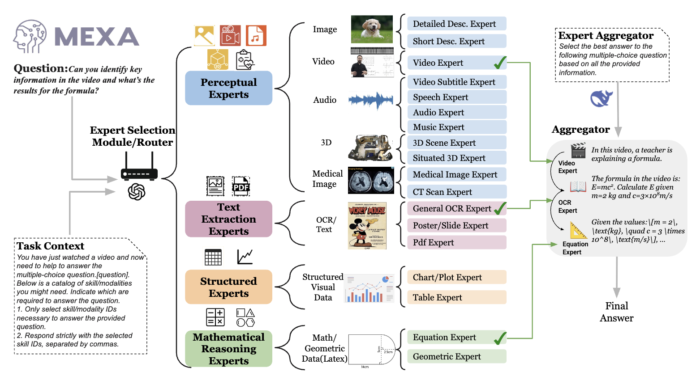

#  MEXA: Towards General Multimodal Reasoning with Dynamic Multi-Expert Aggregation
 [](https://arxiv.org/abs/2402.05889)


### Authors: [Shoubin Yu*](https://yui010206.github.io/),[Yue Zhang*](https://zhangyuejoslin.github.io/),[Ziyang Wang](https://ziyangw2000.github.io/),[Jaehong Yoon](https://jaehong31.github.io/), [Mohit Bansal](https://www.cs.unc.edu/~mbansal/)
### University of North Carolina at Chapel Hill


<br>


# 🔥 News
- **Jun 22, 2025**. Check our [arXiv-version]() for MEXA.


# Code structure
```bash

# CREMA code
./lavis/

# running scripts for CREMA training/inference
./run_scripts

```

# Setup

## Install Dependencies

1. (Optional) Creating conda environment

```bash
conda create -n crema python=3.8
conda activate crema
```

2. build from source

```bash
pip install -e .
```


# Dataset Preparation & Feature Extraction

We will share extracted features. 
| Dataset | Multimodal Features |
| :----    |    :----  | 
| SQA3D | [Video Frames](https://drive.google.com/drive/folders/15b_IdwsbLU9iZPxR1Is3pObl-Le8v1ym), [Depth Map](https://drive.google.com/drive/folders/15b_IdwsbLU9iZPxR1Is3pObl-Le8v1ym), [Surface Normals](https://drive.google.com/drive/folders/15b_IdwsbLU9iZPxR1Is3pObl-Le8v1ym) |
| MUSIC-AVQA | [Video Frames](https://drive.google.com/drive/folders/15b_IdwsbLU9iZPxR1Is3pObl-Le8v1ym), [Optical Flow](https://drive.google.com/drive/folders/15b_IdwsbLU9iZPxR1Is3pObl-Le8v1ym) , [Depth Map](https://drive.google.com/drive/folders/15b_IdwsbLU9iZPxR1Is3pObl-Le8v1ym), [Surface Normals](https://drive.google.com/drive/folders/15b_IdwsbLU9iZPxR1Is3pObl-Le8v1ym) |
| NExT-QA | [Video Frames](https://drive.google.com/drive/folders/15b_IdwsbLU9iZPxR1Is3pObl-Le8v1ym), [Depth Map](https://drive.google.com/drive/folders/15b_IdwsbLU9iZPxR1Is3pObl-Le8v1ym), [Optical Flow](https://drive.google.com/drive/folders/15b_IdwsbLU9iZPxR1Is3pObl-Le8v1ym), [Surface Normals](https://drive.google.com/drive/folders/15b_IdwsbLU9iZPxR1Is3pObl-Le8v1ym) |
| Touch-QA | [Video Frames](https://drive.google.com/drive/folders/15b_IdwsbLU9iZPxR1Is3pObl-Le8v1ym), [Surface Normals](https://drive.google.com/drive/folders/15b_IdwsbLU9iZPxR1Is3pObl-Le8v1ym) |
| Thermal-QA | [Video Frames](https://drive.google.com/drive/folders/15b_IdwsbLU9iZPxR1Is3pObl-Le8v1ym), [Depth Map](https://drive.google.com/drive/folders/15b_IdwsbLU9iZPxR1Is3pObl-Le8v1ym) |


# Inference
We provide MEXA inference script examples as follows.


```bash
sh run_scripts/crema/inference/sqa3d.sh
```


# Reference
Please cite our paper if you use our models in your works:

```bibtex
@article{yu2024crema,
  title={CREMA: Generalizable and Efficient Video-Language Reasoning via Multimodal Modular Fusion},
  author={Yu, Shoubin and Yoon, Jaehong and Bansal, Mohit},
  journal={ICLR},
  year={2025}
}
